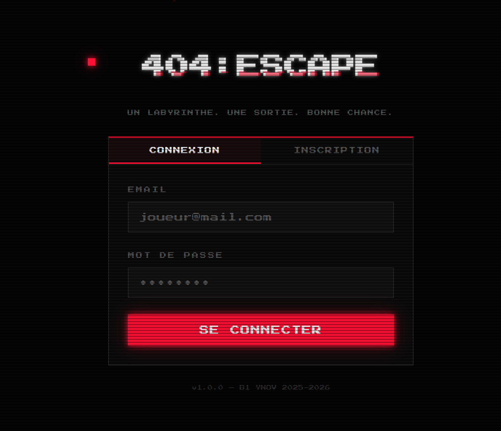
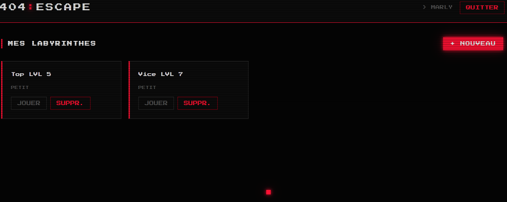
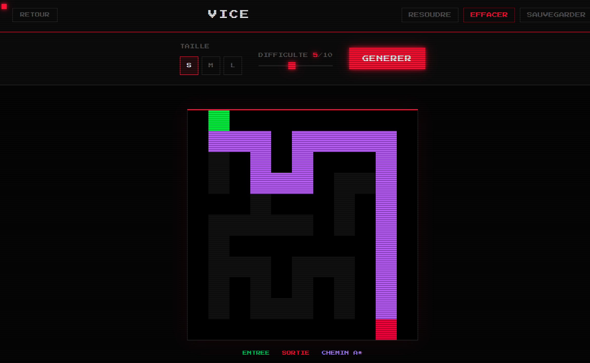
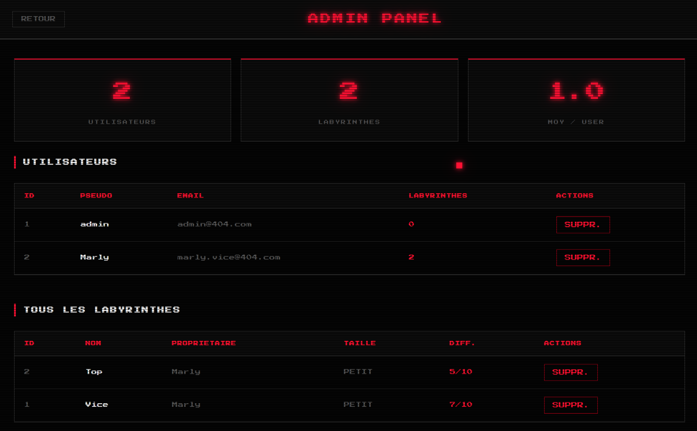

# 404 : Escape 🖥️

> *Après une nième nuit blanche, tu t'endors devant ton écran.*
> *Quand tu ouvres les yeux… tu es à l'intérieur du labyrinthe que tu codais.*
> *Les murs sont faits de lignes de code. Les couloirs clignotent comme des pixels.*
> *Pour t'échapper, tu dois résoudre ta propre création.*
>
> **Vas-tu réussir à t'en sortir ?**

---


---

## 📋 Sommaire

- [À propos](#-à-propos)
- [Fonctionnalités](#-fonctionnalités)
- [Screenshots](#-screenshots)
- [Installation](#-installation)
- [Utilisation](#-utilisation)
- [Stack technique](#-stack-technique)
- [Algorithmes](#-algorithmes)
- [Architecture](#-architecture-du-projet)
- [Choix techniques](#-choix-techniques-justifiés)
- [Équipe](#-équipe)

---

## 🎮 À propos

**404 : Escape** est une application desktop multiplateforme développée avec **Electron (Node.js)**. Elle permet de créer, visualiser, générer automatiquement et résoudre des labyrinthes en pixel art, dans un univers rétro-gaming inspiré des terminaux des années 80.

L'application dispose d'un système d'authentification complet, d'un espace personnel pour chaque utilisateur, et d'un panel d'administration permettant de gérer l'ensemble des utilisateurs et labyrinthes.

---

## ✨ Fonctionnalités

### Authentification
- Inscription sécurisée avec hashage du mot de passe (bcrypt)
- Connexion automatique après inscription (token JWT)
- Déconnexion et gestion des sessions

### Labyrinthes
- **Création** : nommer, choisir la taille (petit/moyen/grand) et la difficulté (1-10)
- **Génération automatique** : deux algorithmes selon la difficulté
- **Résolution automatique** : algorithme A* avec animation du chemin en violet néon
- **Sauvegarde** : chaque labyrinthe est stocké en base SQLite
- **Suppression** : gestion complète CRUD

### Interface
- Boot screen animé avec effet terminal
- Curseur pixel art personnalisé
- Système de sons (Web Audio API + musiques MP3)
- Export du labyrinthe en image PNG
- Notifications toast pixel art

### Administration
- Accès réservé au compte administrateur
- Statistiques globales (nombre d'utilisateurs, labyrinthes, moyenne)
- Gestion complète des utilisateurs (voir, supprimer)
- Consultation de tous les labyrinthes créés

---

## 📸 Screenshots

### Page de connexion


### Dashboard — Mes labyrinthes


### Page labyrinthe — Génération & Résolution


### Panel Administrateur


---

## 🚀 Installation

### Prérequis

> ⚠️ **Important** : ce projet nécessite **Node.js v20 LTS** (pas v22 ni v24).
> `better-sqlite3` n'est pas compatible avec les versions plus récentes sans recompilation.

- [Node.js v20 LTS](https://nodejs.org/dist/v20.20.2/node-v20.20.2-x64.msi)
- Git

### Étapes

```bash
# 1. Cloner le dépôt
git clone https://github.com/FloKBCode/Projet_JS_2_404-Escape.git
cd 404-escape

# 2. Installer les dépendances
npm install

# 3. Recompiler better-sqlite3 pour Electron
npx electron-rebuild

# 4. Lancer l'application
npm start
```

### Identifiants par défaut

Un compte administrateur est créé automatiquement au premier lancement :

| Champ | Valeur |
|---|---|
| Email | `admin@404.com` |
| Mot de passe | `admin123` |

> 💡 Ce compte est créé une seule fois. Si tu veux le recréer, supprime le fichier `escape.db` dans ton dossier utilisateur.

### Installer via l'exécutable Windows

Télécharge directement `404 Escape Setup 1.0.0.exe` dans les [releases](https://github.com/FloKBCode/Projet_JS_2_404-Escape/releases) et lance l'installeur.

---

## 🕹️ Utilisation

### Créer un compte
1. Lance l'application
2. Attends la fin du boot screen
3. Clique sur **INSCRIPTION** et remplis le formulaire
4. Tu es automatiquement connecté après l'inscription

### Créer un labyrinthe
1. Sur le dashboard, clique sur **+ NOUVEAU**
2. Choisis un nom, une taille et un niveau de difficulté
3. Le labyrinthe est généré et sauvegardé automatiquement

### Jouer
1. Clique sur **JOUER** depuis une carte du dashboard
2. Tu peux aussi générer un nouveau labyrinthe directement depuis la page de jeu
3. Clique sur **RÉSOUDRE** pour voir la solution animée en A*
4. Clique sur **EXPORTER** pour sauvegarder le labyrinthe en PNG

### Accès Admin
1. Connecte-toi avec `admin@404.com` / `admin123`
2. Le bouton **ADMIN** apparaît dans le header
3. Tu accèdes aux statistiques, à la liste des utilisateurs et de tous les labyrinthes

---

## 🛠️ Stack technique

| Technologie | Rôle | Pourquoi |
|---|---|---|
| **Electron 29** | Application desktop | Permet de créer une app native Windows/Mac/Linux avec du web (HTML/CSS/JS) |
| **Node.js 20** | Runtime backend | Nécessaire pour Electron et les modules natifs |
| **SQLite** (better-sqlite3) | Base de données | Fichier unique, pas de serveur, parfait pour une app desktop |
| **bcryptjs** | Hashage des mots de passe | Algorithme de hashage sécurisé, irréversible |
| **jsonwebtoken** | Authentification | Système de tokens sans état, pas besoin de stocker les sessions en DB |
| **Web Audio API** | Sons du jeu | Génération de sons pixel art directement en JavaScript, sans fichier externe |
| **HTML5 Canvas** | Rendu des labyrinthes | API native pour le dessin pixel par pixel |

---

## 🧠 Algorithmes

### Génération — DFS (difficulté 1 à 6)

**Depth-First Search** (recherche en profondeur) : l'algorithme part d'une cellule et creuse des passages en explorant récursivement ses voisins non visités dans un ordre aléatoire. Quand il est bloqué, il revient en arrière (*backtrack*) et repart dans une autre direction.

**Résultat** : de longs couloirs avec peu de bifurcations. Le labyrinthe est relativement facile à résoudre visuellement.

```
Grille de départ (tout murs)    Après DFS
█████████                       █ █ █ █ █
█████████       ──────▶         █ ░ ░ ░ █
█████████                       █ ░ █ ░ █
█████████                       █ ░ ░ ░ █
█████████                       █ █ █ █ █
```

### Génération — Kruskal (difficulté 7 à 10)

**Algorithme de Kruskal aléatoire** : on liste tous les murs possibles, on les mélange aléatoirement, puis on abat chaque mur uniquement si les deux cellules qu'il sépare n'appartiennent pas encore au même ensemble (structure **Union-Find**). Cela garantit un labyrinthe parfait (un seul chemin entre chaque paire de cellules) sans boucles.

**Résultat** : beaucoup de cul-de-sac courts dans toutes les directions. Le labyrinthe est dense et difficile à résoudre intuitivement.

### Résolution — A* (A-star)

**A\*** est un algorithme de recherche de chemin qui combine deux informations pour explorer intelligemment :
- **g** : le coût réel depuis le départ (nombre de cases parcourues)
- **h** : une estimation (*heuristique*) de la distance jusqu'à la sortie — on utilise la **distance de Manhattan** : `|x1-x2| + |y1-y2|`

À chaque étape, A* explore la case avec le plus petit score `f = g + h`. Cette stratégie garantit de trouver **toujours le chemin le plus court**, tout en étant bien plus rapide qu'une exploration exhaustive.

**Résultat** : chemin optimal affiché en violet néon, animé case par case.

---

## 📁 Architecture du projet

```
404-escape/
│
├── main.js           # Point d'entrée Electron — fenêtre + canaux IPC
├── preload.js        # Pont sécurisé renderer ↔ Node.js (contextBridge)
├── auth.js           # Authentification — bcrypt + JWT
├── database.js       # SQLite — connexion + toutes les fonctions CRUD
├── labyrinth.js      # Algorithmes DFS, Kruskal, A*
├── admin.js          # Interface admin (renderer) — stats, users, labyrinthes
├── package.json      # Dépendances + config electron-builder
│
└── renderer/         # Interface graphique (HTML/CSS/JS)
    ├── index.html    # Page unique — toutes les sections de l'app
    ├── style.css     # Styles pixel art (variables CSS, animations)
    ├── app.js        # Logique front — navigation, événements, IPC
    └── assets/
        ├── music/    # Musiques de fond (menu.mp3, game.mp3)
        └── sounds/
            └── sounds.js   # Sons générés via Web Audio API
```

### Flux de communication IPC

```
renderer/app.js
     │
     │  window.api.invoke('canal:action', données)
     ▼
preload.js  (contextBridge — sécurité)
     │
     │  ipcRenderer.invoke(...)
     ▼
main.js
     │
     │  ipcMain.handle('canal:action', handler)
     ▼
database.js / auth.js / labyrinth.js
```

---

## 💡 Choix techniques justifiés

### Pourquoi Electron ?
Electron permet de développer une application desktop native en utilisant des technologies web (HTML, CSS, JavaScript), que toute l'équipe maîtrise. Il est utilisé par des applications comme VS Code, Slack ou Discord. L'alternative aurait été Tauri (plus léger) mais plus complexe à apprendre en partant de zéro.

### Pourquoi SQLite plutôt que MySQL ou PostgreSQL ?
SQLite stocke toute la base de données dans un seul fichier local. Pour une application desktop sans serveur centralisé, c'est le choix évident : pas d'installation, pas de configuration réseau, et les performances sont largement suffisantes pour notre volume de données.

### Pourquoi better-sqlite3 plutôt que sqlite3 ?
`better-sqlite3` est synchrone (pas d'`async/await`), ce qui simplifie considérablement le code. Il est aussi significativement plus rapide que le package `sqlite3` classique.

### Pourquoi JWT plutôt que les sessions classiques ?
Les tokens JWT sont **sans état** : le serveur n'a pas besoin de stocker les sessions en base. Le token contient lui-même les informations de l'utilisateur (id, rôle) et sa signature garantit qu'il n'a pas été modifié.

### Pourquoi DFS pour les difficultés basses et Kruskal pour les hautes ?
DFS génère des labyrinthes avec de longs couloirs — visuellement satisfaisants et relativement accessibles. Kruskal produit des structures plus homogènes et imprévisibles, avec de nombreux cul-de-sac, ce qui correspond à une difficulté perçue plus élevée.

### Pourquoi A* pour la résolution ?
A* garantit le chemin optimal (le plus court) tout en étant bien plus rapide que BFS sur des grandes grilles grâce à son heuristique. Pour un labyrinthe 31×41 (grande taille), la différence de performance est significative.

---

## 👥 Équipe

Projet réalisé dans le cadre du cours de développement JavaScript — Paris Ynov Campus, Bachelor 1 Data Engineering, 2025-2026.

| Membre | Rôle | Fichiers principaux |
|---|---|---|
| **Florence** | Coordinatrice + Backend complexe | `main.js`, `auth.js`, `labyrinth.js`, `preload.js` |
| **Marly** | Frontend + Interface Admin | `renderer/index.html`, `renderer/style.css`, `admin.js`, `sounds.js` |
| **Sarah** | Frontend + Base de données | `database.js`, `renderer/app.js` |

---

## 📄 Licence

Projet — Paris Ynov Campus 2025-2026.